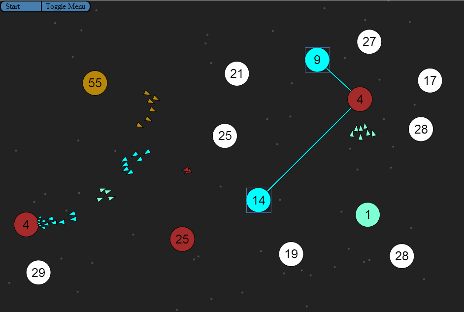

Planetary Triumph Online
========================

A javascript based game reminiscent of Galactic Conquest.

Try out the game [here](https://googledrive.com/host/0BwSnjeZk1C5RQXZvTUc0NUtOc2M/). (tested with firefox 21.0 and chrome 27.0.1453.110)  
Gameplay
========

Planetary Triumph is a fast paced web-based strategy game. The player's objective is to capture opposing planets by sending fleets from his or her own. The game is single player with up to 5 AI opponents. A screenshot of an in-progress game may be found below.

The player's planets and ships are designated by the light blue color. The number on each planet designates the 'population' of that planet. This population grows at a constant rate for all owned planets. The player may attempt to capture enemy or neutral planets by sending their own population.
Each in flight 'ship' represents the movement of one population.
Controls
========

A player's 'active group' consists of all of the player's currently selected planets. A player's planet may be added to the current group by either clicking on the planet if the current group is empty, or by click and dragging if the group is not. The target planet may be designated by left-clicking.
It is important to note that a player can designate his or her own planet as a target, this can be useful if an enemy attack is eminent, etc.

The options menu may be shown at any time by pressing the 'toggle menu' button in the upper left. The menu itself consists of several numeric fields each of which allow the player to configure a different setting. Generally, if a setting could possibly be changed in real-time, it will be.
That is, if the player changes the gravitational constant or the repulsion of ships from each other, these values will be updated automatically. However, the user must restart the game to add additional AI players, etc.
Backend
=======

The application is pure javascript. A heavily modified version of the [Fabric.js](http://fabricjs.com/) library was used for rendering the planets and ships as well as most animations. Animations on the options menu are provided by jQuery.